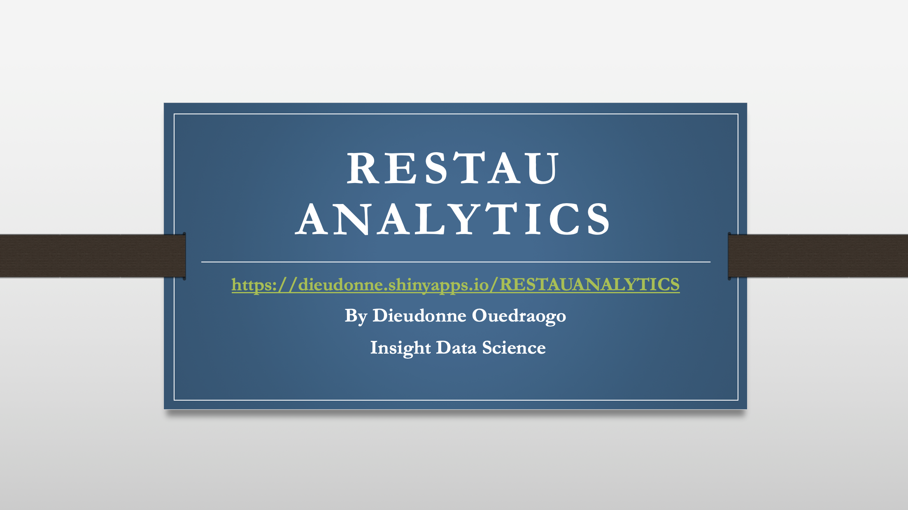

# RestauAnalytics
The Web-App

NYC restaurants are regularly inspected and assigned violation scores. This App predicts the violation scores and to retrieve restaurants likely to fall into bad grades in the next inspection cycle.
Random Forest, Linear Regression, Decision Trees, Gradient Boosting and a Baseline of predicting the next score by using the last are all considered in the modeling process.

https://dieudonne.shinyapps.io/RESTAUANALYTICS/

you can reach me by at

dieudo2008@gmail.com

Data sources

https://data.cityofnewyork.us/Health/DOHMH-New-York-City-Restaurant-Inspection-Results/43nn-pn8j/data

