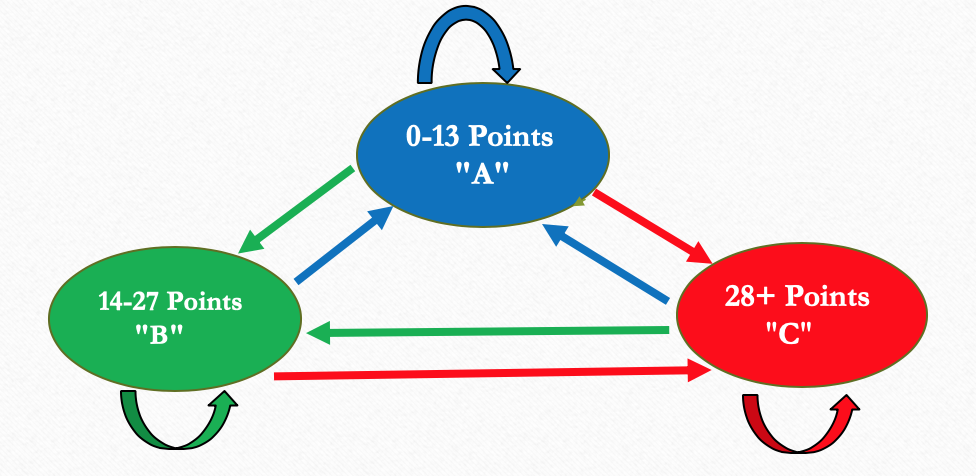
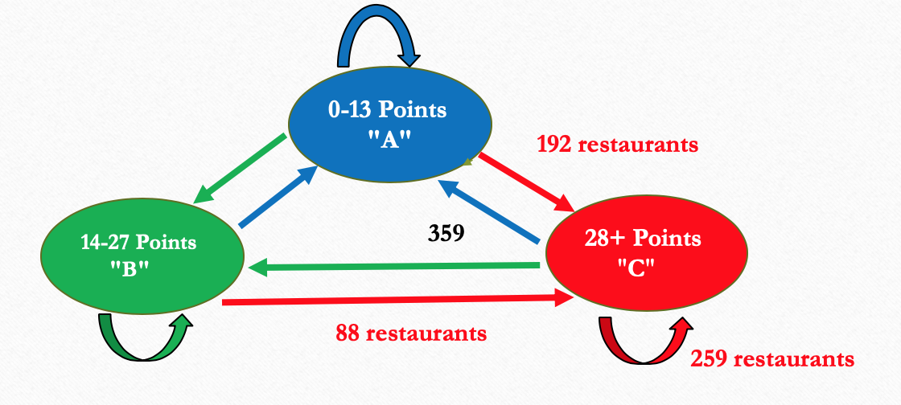

# RestauAnalytics

## Introduction

NYC restaurants are regularly inspected and assigned violation scores. This App aims to capture restaurants likely to fall into bad grades in the next inspection cycle.

Random Forest, Linear Regression, Decision Trees, Gradient Boosting and a Baseline of using the last value are all considered in the modeling process.

The tool could be used by NYC food inspectors or stakeholders to prioritize their tasks. 

## Data source

https://data.cityofnewyork.us/Health/DOHMH-New-York-City-Restaurant-Inspection-Results/43nn-pn8j/data

## The process

The dataset from the above source is a transactional dataset.
It required cleaning and processing :

The restaurants are grouped, the time stamps are ranked, and new features are built using following values obtained by the restaurant during previous inspections.

During Data cleaning, data transformations, data exploratory,  features engineering, data modeling, various data frames, and results are obtained and saved into csv files which could be found in this repository.

## Schema of the problem from the last value to the next value

## The priority

## Modeling

This a regression problem as the violations score are numerical values.
Random forest followed by a rule-based algorithm. 

## The final outcome and results

## The Web-app

https://dieudonne.shinyapps.io/RESTAUANALYTICS/

## For comments and suggestions 

dieudo2008@gmail.com 

https://www.linkedin.com/in/dieudonneo/

